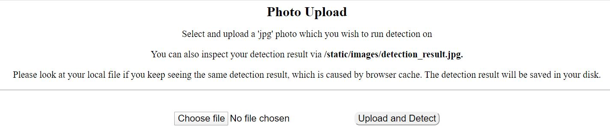
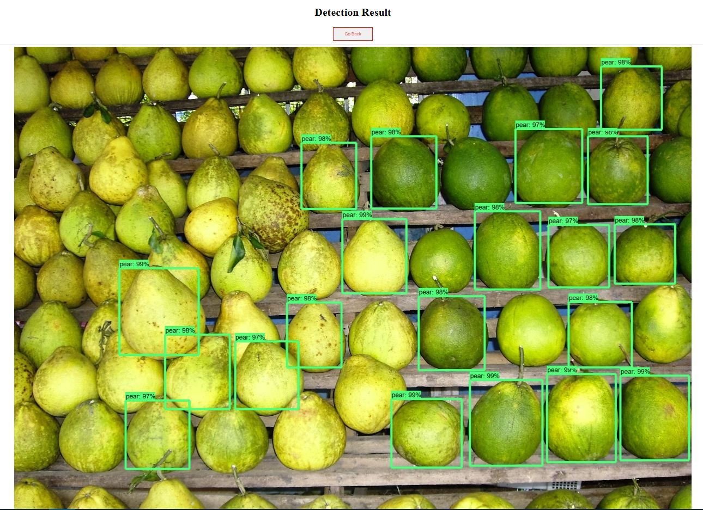

# Faster R-CNN for Fruit Detection

This is repo implements Faster RCNN to detect pears and bananas on python3, TensorFlow and Flask. This repo is a forked repo, which built on the already established framework contributed by the TensorFlow team. The original repo can be found [here](https://github.com/tensorflow/models).

# Honour Original Work

```
"Speed/accuracy trade-offs for modern convolutional object detectors."
Huang J, Rathod V, Sun C, Zhu M, Korattikara A, Fathi A, Fischer I, Wojna Z,
Song Y, Guadarrama S, Murphy K, CVPR 2017
```

# Requirements

System environment: Windows

- Protobuf 3.11.3
- Python-tk
- Pillow
- opencv-python
- lxml
- tf Slim (which is included in the "tensorflow/models/research/" checkout)
- Matplotlib
- Tensorflow 1.14-gpu
- Cython
- contextlib2
- cocoapi

# Step-by-step Installation Guide

1. Clone this repository to your desired local project directory

   ```
       YOUR_PROJECT_DIR
       └── models
   ```

2. If you have a Nvidia GPU, it is **compulsory** to install a GPU version of TensorFlow in order to run this repo. To install, issue the command shown below. Please also follow step 3 and 4 to setup your graphic card. 

   ```bash
     pip install tensorflow-gpu==1.14
   ```

   If you don't have a Graphic Card, simply install TensorFlow via

    ```bash
      pip install tensorflow==1.14
    ```

3. **[Follow only If you have a GPU card]**Go to the [Nvidia Website](https://developer.nvidia.com/cuda-10.0-download-archive), Follow the instructions to install CUDA Toolkit 10.0 Archive. 

   1. Note that you may need to install Microsoft Visual Studio 2017 if the installation program asks.

4. **[Follow only If you have a GPU card]**Download [cuDNN v7.6.5 (November 5th, 2019), for CUDA 10.0](https://developer.nvidia.com/rdp/cudnn-download#a-collapse765-10)] zip file and unzip it to a folder. 

   1. Copy all the cuDNN components to `C:\Program Files\NVIDIA GPU Computing Toolkit\CUDA\v10.0 ` 

   2. Copy the unzipped cuda folder to `C:\tools`, so that cuda exists at `C:\tools\cuda` 

   3. **[IMPORTANT]** Setup path of Toolkit, otherwise tensorflow-gpu will not be able to run. 

      Issue the following command in the terminal:

      ```
      SET PATH=C:\Program Files\NVIDIA GPU Computing Toolkit\CUDA\v10.0\bin;%PATH%
      SET PATH=C:\Program Files\NVIDIA GPU Computing Toolkit\CUDA\v10.0\extras\CUPTI\libx64;%PATH%
      SET PATH=C:\Program Files\NVIDIA GPU Computing Toolkit\CUDA\v10.0\include;%PATH%
      SET PATH=C:\tools\cuda\bin;%PATH%
      ```

5. Restart the computer. Test that GPU Toolkit is ready for TensorFlow. 

   1. Issue the command `nvcc -V` to verify CUDA and cuDNN installation, you should see the version of your CUDA tools. 
      

   2. If you encountered any error, please reinstall again. Here are some useful Tutorials to help to install the TensorFlow, CUDA and cuDNN. 

      1. [[Useful Configuration Tutorial]](https://tensorflow-object-detection-api-tutorial.readthedocs.io/en/latest/install.html)  

         [[Tutorials1]](https://www.tensorflow.org/install/gpu) 

         [[Tutorial2]](https://docs.nvidia.com/deeplearning/sdk/cudnn-install/index.html#install-windows) 

6. Test You can start the TensorFlow-GPU without errors by issue the command in `Python` 

   ```bash
      import tensorflow as tf
      hello = tf.constant('Hello, TensorFlow!')
      sess = tf.Session()
      print(sess.run(hello))
   ```

      

7. Then install other libraries

```
pip install Cython
pip install contextlib2
pip install pillow
pip install pandas
pip install lxml
pip install jupyter
pip install matplotlib
pip install opencv-python
pip install Flask
```

8. Follow the [instructions](https://github.com/philferriere/cocoapi) and install cocoapi. 

9. Install Protobuf V3.11.3, using the follow command. This step is very important, it is compulsory to run the detection

   1. ```
      pip install protobuf
      ```

   2. To verify installation, issue 'protoc' in the terminal. You should see similar output like this:

10. Configure PYTHONPATH environment variables. A PYTHONPATH variable must be created that points to the \models, \models\research, and \models\research\slim directories.

   11. 

12. Run setup.py

    1. Navigate to models/research, issue command 

       ```
           python setup.py build
           python setup.py install
       ```

    2. Then Navigate to models/research/slim, Delete existing BUILD file if any. Then issue command

       ```
           python setup.py build
           python setup.py install
       ```

13. Test the installation, navigate to the models/research/object_detection/builders/, issue the command

        python model_builder_test.py

     

# Project Structure

```
models
    ├── assets  //images for README
    ├── research 
    |.................
    |   └── object_detection
    |.................
    |   |   └── data
    |   |   |   └── faster_RCNN_banana_and_pear 	//trained model
    |   |   |   └── faster_RCNN_pear_only_v2 		//trained model
    |.................
    |   |   └── uploaded images		//folder to store the uploaded image by users
    |   |   └── app-2class.py		//flask server to detect pear and banana
    |   |   └── app-pearonly.py		//flask server to detect pear
    |.................
    |   |   └── index.html
    |   |   └── upload_detect.html
    
```

# Starting the server

```bash
$ cd DIR_TO_YOUR_PROJECT/models/research/object_detection
$ python3 app-2class.py		//if you want to detect pear and banana
$ python3 app-pearonly.py	//if you want to detect pea only
```

Setting up the server can take a while as it has to initialize the model, usually it takes up to 1 minute. Please be patient. If you see the following outputs from the console, the server has been set up successfully.


# Usage

1. Open a web browser and visit `http://127.0.0.1:5000/`
2. Click The `Detect` button if you wish to run standard fruit detection. 
3. Click `Choose File` button to chose a 'jpg' image, then upload the image to model via `Upload and Detect`button. Wait for the computer to run the detection. The detection time can vary depends on the image quality, fruit density and computational power. 
4. The detection result will be shown on another page. Please also note that the detection result will be saved to `object_detection/static/images/detection_result.jpg`. Manually inspect result can be useful if you keep seeing the same output on the webpage, which is caused by browser cache.
5. If you wish to detect another image, click the go back button and follow the above steps again. 

## Note

This app was developed for COMP90055 Research Project supervised by Prof. Richard Sinnott.

Author of the project:

- Chengsheng Wang